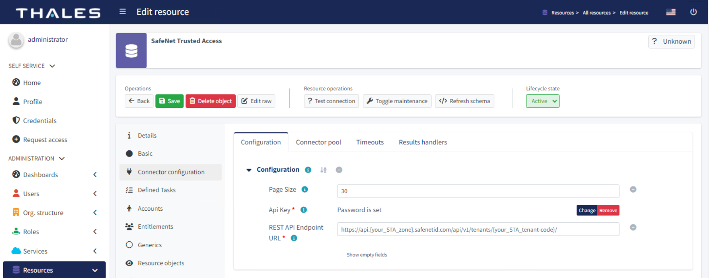

# STA IdM Connector: Identity Connector for SafeNet Trusted Access over REST APIs

## Get started

The STA IdM Connector is based on ConnId framework version 1.5.0.0. When used with [midPoint][def] (an open-source identity management and identity governance solution), the connector allows provisioning and de-provisioning of users, as well as management of their associated user groups between, [SafeNet Trusted Access (STA)][def2] and a third-party directory (for example, Microsoft Active Directory, Microsoft Azure Active Directory, etc.).

### Capabilities and Features

| Feature                | Supported?    | Notes                                      |
| ---------------------- | ------------- | ----------------------------               |
| User synchronization   | YES           | Supports all CRUD operations               |
| Group synchronization  | YES           | Supports all CRUD operations               |
| Live Synchronization   | YES           | Supported only for users                   |
| Password               | NO            | Password sync is currently not supported   |
| Paging support         | YES           | Simple page results                        |

The connector is meant to be compatible with the IdM Services using ConnId framework. The connector has been tested on Evolveum midPoint.

### How to use?

1. Download the connector from the release section.
2. Deploy the connector jar file inside your IdM service, for example, midPoint.
3. Restart the service (if required).
4. Create a new connector instance and configure the basic configurations.

   

5. Follow next steps as per your IdM service.

## Documentation

Documentation is available at [Thalesdocs][def3].

## Contributing

If you are interested in contributing to the STA IdM connector project, start by reading the [Contributing guide](/CONTRIBUTING.md).

## License

The project uses [Apache-2.0 license](/LICENSE).

[def]: https://docs.evolveum.com/midpoint/
[def2]: https://cpl.thalesgroup.com/access-management/safenet-trusted-access
[def3]: https://thalesdocs.com/sta/operator/user_synchronization/user_provisioning_through_safenet_trusted_access_idm_connector/index.html